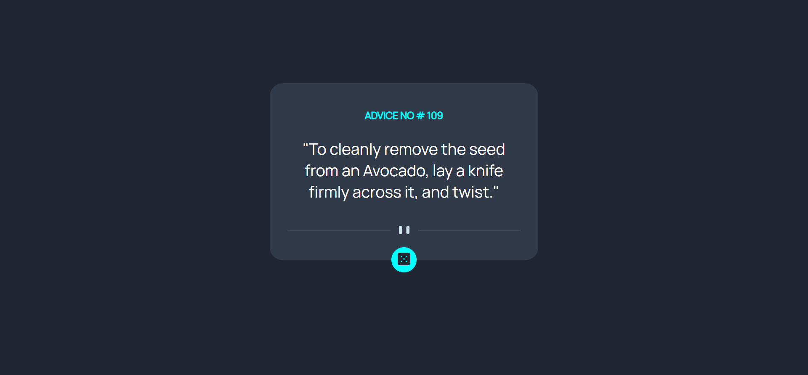

# Frontend Mentor - Advice generator app solution

This is a solution to the [Advice generator app challenge on Frontend Mentor](https://www.frontendmentor.io/challenges/advice-generator-app-QdUG-13db). Frontend Mentor challenges help you improve your coding skills by building realistic projects.

## Table of contents

- [Overview](#overview)
  - [The challenge](#the-challenge)
  - [Screenshot](#screenshot)
  - [Links](#links)
- [My process](#my-process)
  - [Built with](#built-with)

## Overview
This is an advice generator app that uses the [AdviceSlip API](https://api.adviceslip.com/) to fetch data from a remote server.

### The challenge

Users should be able to:

- View the optimal layout for the app depending on their device's screen size
- See hover states for all interactive elements on the page
- Generate a new piece of advice by clicking the dice icon

### Screenshot

### Links

- Solution URL: [https://github.com/EliusHHimel/advice-generator](https://github.com/EliusHHimel/advice-generator)
- Live Site URL: [https://eliushhimel.github.io/advice-generator/](https://eliushhimel.github.io/advice-generator/)

## My process

### Built with

- Semantic HTML5 markup
- CSS
- Flexbox
- Javascript

## Author

- Website - [EliusHHimel](https://eliushhimel.github.io/)
- Frontend Mentor - [@EliusHHimel](https://www.frontendmentor.io/profile/EliusHHimel)
- Twitter - [@EliusHHimel](https://www.twitter.com/EliusHHimel)
- LinkedIn - [@EliusHHimel](https://www.linkedin.com/in/EliusHHimel)

